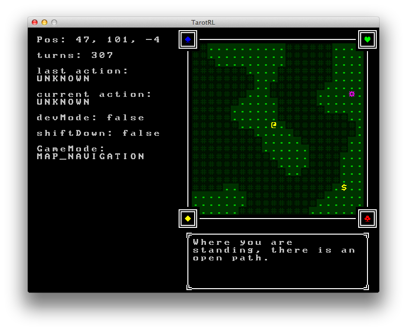

# TarotRL

A very in-progress procedurally generated Roguelike, developed in Java using [Ziron](https://github.com/Hexworks/zircon) to render ASCII tile map graphics.



The bulk of the intent of this programming exercise is two fold:

1. Engineering a robust, easily understood and maintainable
   game engine that I can use as a basis for all future side
   projects and whims.  Something easy where I can focus on
   fun gameplay concepts rather than engine limitations.
2. Explore ideas of procedural generation and randomized
   gameplay elements relating to the Tarot.  With a rich history
   of symbolism and concepts to draw from, drawing Tarot cards
   when I need a random number, word, or thing and using this
   as the seed was the initial idea driving what features I'd
   implement into the game.

How successful was I in these endeavors?  Concerning #1, fairly.  For the 3 weeks of dev work I've
invested in this project during April, the basic features of a game engine were reasonably fleshed
 out and functional.  The main game loop with event handling, updating the game state, and drawing
 graphical updates allows for the rudimentary gameplay of a minimum viable product.

However, concerning #2, most of the fun and interesting gameplay elements have yet to be added.
While the map generation and navigation systems feel solid and easily extensible, additional
components like menus, an inventory management system, clear goals for the player to achieve,
and - most critically - integrating the Tarot, is yet somewhat lacking.  Should I choose to pick
up development at a later time, these are the areas I would immediately address.

And being a quickly iterated proof-of-concept side project, there are many side components and
features that are at various states of completion and inclusion, or use differing main methods
before the additional game modes are fully integrated into the game.

Overall, I am satisfied with the result for the time and effort invested.

## Gameplay

Development and evolution of gameplay and features is very much in flux.  Currently you can explore a
set of descending cave levels.  Navigate with the arrow keys, collect some simple assorted items `*` and `$` on the floor by moving over them.  Descend the stairs `<` and `>` with `Enter`.  Also, the beginnings of a menu system will toggle on the screen with `i`.

Other map types not included in the current build have interactable doors.  There are more nuanced input options for features at varying levels of implementation.  For now, the curious can inspect them in the input system.

## Build

To build and run with Maven:

```
mvn clean install
java -jar target/TarotRL-1.0-SNAPSHOT.jar
 ```
